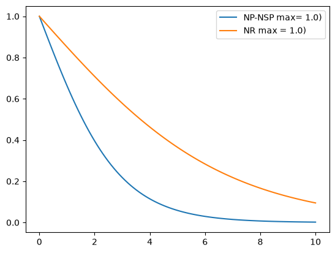
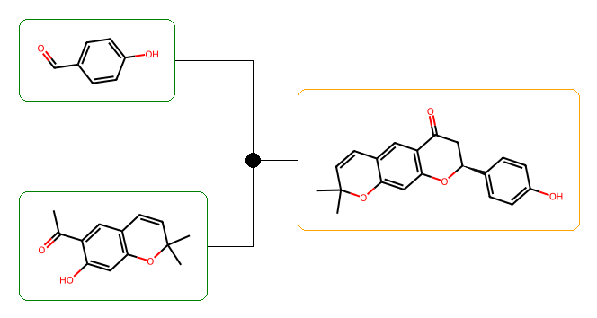
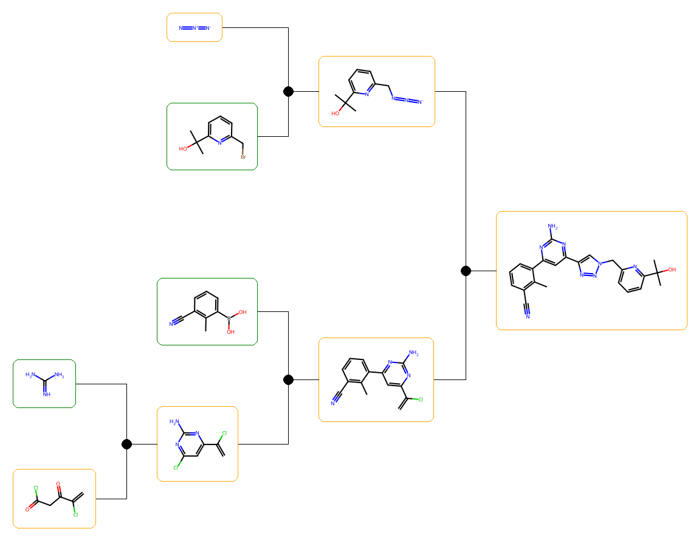

# Отчет

## Условия

Приведены условия выполнения задания и логичный способ решения.

1. _**Дан датасет молекул для оценки.**_

   Все молекулы приведены в формате SDF в 2D представлении. Значит, можно использовать напрямую SMILES без необходимости учитывать стереохимию (ярко видно на примере 27 из датасета)

2. _**Нужно использовать `aizynthfinder` для работы**_

   Движка есть проблема - его сложно распараллелить из-за внутренней структуры. А так как нужно настроить именно его, будет проще скопировать структуры, и сделать параллельно работающий инструмент. (Для этих целей возможно лучше использовать `MultiAiZ`)

3. _**Найти числовую функцию синтетической сложности и вычислить её на датасете.**_

   Так как некоторые молекулы могут не иметь синтетического пути, функция должна учитывать этот факт и не обнулять значение в таком случае. Очевидно, нужно учитывать не только сложность пути и количество узлов, но и стоимость прекурсоров.

   Логично использовать уже готовые метрики, которые были провалидированы на реальных датасетах и имеют оценку экспертов.

4. _**Не указаны: база данных, стоимость доступных реагентов, предпочтительные реакции**_

   Без этой информации можно использовать стандартный набор реагентов с их стоимостью. Например, тот, который скачивается вместе с библиотекой `aizynthfinder` (модели фильтрации и поиска пути, обученные на `UPSTO` базе данных реакций, `ZINC` - база прекурсоров).

   Исходя из этого, можно напрямую использовать стороннюю метрику, которая использует `aizynthfinder` в качестве отправной точки.

   Нельзя использовать скорринг-функции, которые основаны на внешних датасетах. Если будет использоваться внутренняя база прекурсоров, в ней, скорее всего, уже будут включены цены. Поэтому не имеет смысла оценивать цены прекурсоров.

5. _**Нужны данные о скорости расчёта.**_

   Молекул много, значит нужно использовать параллельные вычисления. Нужно логирование или хотя бы сохранение времени расчёта для каждой отдельной молекулы.

## Использованные функции скоринга

Код представлен в `scoring.ipynb`

**Доступность**

- `NPrecursors (NumberOfPrecursorsScorer)` - `NStockPrecursors (NumberOfPrecursorsInStockScorer)`

  Сток один, поэтому можно грубо оценить, сколько прекурсоров есть в банке веществ. Чтобы учесть не только долю, но и абсолютное количество (так как абсолютное количество показывает и сложность реакции), можно использовать разницу между общим количеством прекурсоров и доступных прекурсоров. (Для нескольких стоков логично использовать `NSourcePrecursors (StockAvailabilityScorer)` c указанием качества источников или цены)

  Лучше чем просто доля прекурсоров в стоке (_FractionInStockScorer_ в _state score_) так как накладывает штраф относительно и количества прекурсоров в сумме

**Маршрут**

- `NReactions (NumberOfReactionsScorer)`

  Основной показатель, который характеризует длину маршрута.

  Лучше характеризует всю цепочку реакций, нежели чем глубина самой длинной цепочки (_MaxTransformScorer_ в _state score_)

**Сложность молекулы**

- `DSCScore (DeltaSyntheticComplexityScorer)`

  Характеризует сложность реакции (сложность перехода от одной молекулы к другой), отражает реальный синтетический путь. Нужно дообучать на своей базе данных. Разница в метриках SCScore

**Цена**

Цены точно требуют своей базы данных.

**Оценка молекул без маршрута.**

Если путь не найден, метрики, оценивающие маршрут или стоимость прокурсоров, будут давать странный результат.

- `SCScore (Custom)`

  Характеризует сложность самой молекулы, отражает реальный синтетический путь до неё.

- `BR-SAScore (Custom)`

  Требуется обучить на своём наборе реакций, Но в оригинальной статье использовался aizynthfinder со стандартным стоком и фильтрами. Сравнивалась эффективность и скорость работы с другими метриками. К тому же она очень быстрая. [Статья](https://link.springer.com/article/10.1186/s13321-024-00879-0)

  Хорошо оценивает медицинские молекулы. Даже если синтетический путь не найден, высокое значение этой метрики может свидетельствовать о том, что молекула полезна и стоит перестроить модель ретросинтеза. Исходный набор данных содержит достаточно много молекул с большим количеством циклов, что свидетельствует о том, что молекулы могут использоваться как биологически активные. Имеет смысл использовать с меньшим весом, нежели _SCScore_

**Не вошли в рассмотрение**

- `TemplateOccurrence (AverageTemplateOccurrenceScorer)`

  SCScore уже оценивает частоту встречаемости реакций, так как была обучена чтобы искать наиболее простой путь.

- `FSscore`

  Можно дообучить на своём стоке и наборе реакций, но для этого требуется целая инфраструктура разметки. А также адаптация под сборку оригинального проекта.

- `RAScore`

  Использует старую версию python=3.7 - требуется адаптация всех пакетов и проверка работы

### Масштабирование

Можно использовать масштабаторы для этой оценки, но можно масштабирование встроить и в саму функцию. Чтобы записать вместе характеристики, нужно привести диапазоны к единому:

- **NPrecursors (NP), NStockPrecursors (NSP)** [1,inf) - обычно требуется от 3-10 => используем сигмойду
- **NReactions (NR)** [0,inf) - обычно требуется от 1-8 => используем сигмойду
- **BR-SAScore (SAS)** [0,1] - специально масштабированная в классе скорера
- **SCScore (SCS)** [0,1] - специально масштабированная в классе скорера
- **DSCScore (DSCS)** [0,1] - специально масштабированная в классе скорера

### Итоговая формула

(0 - плохо, 1 - отлично).

Веса взяты с учётом важности отдельных функций. Для генерации дерева:

- **NR (0.4)** - важно свести к минимуму количество потенциальных реакций
- **DSCS (0.3)** - основной предиктор сложности реакции
- **NP-NSP (0.3)** - наличие в стоке одинаково важно

Для оценки молекулы:

- **SCS (0.7)** - основной предиктор сложности молекулы
- **SAS (0.3)** - грубая оценка структуры молекулы по некоторым эвристикам, Может помочь найти потенциально важные молекулы, которые требуют дополнительной проверки.

$$
\left\{\begin{matrix} \\
0.4\frac{2}{1+e^{0.3~NR}}
+ 0.3\frac{2}{1+e^{0.7~(NP-NSP)}}
+ 0.3 ~ DSCS
& internal \\

0.3~SAS
+ 0.7~SCS
& if ~ not ~ solved
\end{matrix}\right.
$$

### Краткое обоснование, параметров сигмойды

## Использование AiZynthFinder

Для удобного и много поточного запуска функций ретросинтеза сделана обертка в виде набора функций и классов для простого и интуитивного использования инструмента.

### Структура

Обертка для ретросинтеза импортируется как набор модулей для отдельных задач:

- `parameters` - настройки движка
- `scores` - набор доступных скорринговых функций
- `draw` - инструменты для отчётов, рисования и так далее.
- `analyze` - инструменты для анализа маршрутов
- `retro` - основные функции ретросинтеза.

Общая структура

- `chemrar_retro` - Python библиотека-обёртка `aizynthfinder`
  - `scores` - набор оберток над скорерами для типизации параметров
  - `analyze` - набор функций анализа дерева (движка с деревом)
  - `draw` - функции для генерирования картинок или генерирования отчета
  - `parameters` - параметры для настройки движка и функций скоринга
  - `retro` - основные функции для ретросинтеза
- `examples` - ноутбуки основных действий
  - `scoring.ipynb` - основной ноутбук, где проведены вычисления на датасете, описание функции скорринга
  - `problems.ipynb` - ноутбук с подводными камнями обёртки `aizynthfinder`
- `data` - модель и входной датасет
- `doc` - описание задачи
- `typings/rdkit-stubs` - stub файлы для `rdkit`, так как poetry устанавливает "плохую версию" rdkit, без нормальной поддержки типов (устанавливать из conda только rdkit не удобно - poetry перезаписывает conda библиотеки, а устанавливать все из conda нельзя - не все есть в conda-каналах)
- `report.pdf` - отчет о расчете датасета

### Алгоритм работы

Все так же как у оригинала, но в обертке для валидации сборки посредством явной типизации (в основном):

1. Собрать движок из всех используемых политик расширения, скореров, стоков
2. Выбрать требуемые компоненты (вернется копия движка)
3. Сгенерировать стартовое дерево для молекулы (вернется копия движка)
4. Рассчитать дерево (отделен от предыдущего из-за того что может понадобиться повторный запуск с большим числом шагов)
5. Проанализировать дерево скорером
6. Отобразить/собрать результаты анализа

### Допущения

Описаны в условиях и в пункте о метриках.
Кратко:

1. Параллелизация за счет поверхностной копии компонентов движка и копии кэшей
2. Стандартный сток, фильтр и политика расширения
3. Отсутствие учета цены (из-за отсутствия конкретной базы цен)
4. Не высокая важность коэффициентов в линейной комбинации отдельных функций оценки сложности марсшрута и молекулы - такие параметры лучше подгонять под конкретный набор, все метрики интуитивно показывают именно сложность синтеза, а значит скорректированы
5. Опущены предпочтительные реакции и ранжирование стоков
6. Не учитывается хиральность (ее нет в датасете)

### Проблемы

Код представлен в `problems.ipynb`

1. Проблемы с оберткой _aizynthfinder_

   Оригинальный `aizynthfinder.aizynthfinder.AiZynthFinder` - по сути своей, набор функций вокруг базового класса `aizynthfinder.context.config.Configuration`. Этот класс собирается при чтении файла или сборки из словаря и передаётся целиком в каждый компонент `AiZynthFinder`.
   Чтобы параллельные потоки не создавали гонку и не искажали вычисления друг друга, нужно превратить _AiZynthFinder_ в чистую функцию, без сайд-эффектов.

   Подробнее в `problems.ipynb`

2. Диапазон и монотонность скоринг функций

   Проблема заключается в том, что функции в библиотеке aizynthfinder неконсистентны - их нельзя просто скомбинировать вместе. Для этого написан собственный класс-обёртка `Score`. Инициализация которого не требует объявления движка и содержит в себе класс нужного скоррера.

   Подробнее в `problems.ipynb`

3. Адаптация SCScore

   Взята модель full_reaxys_model_1024bool из https://github.com/connorcoley/scscore/tree/master.

   Код адаптации весов в `problems.ipynb`

## Результат

12 потоков на

- CPU: AMD Ryzen 5 7500F 6-Core
- GPU: RTX 5070
- RAM: 16 GB

**Общее время = 7333.4 s**

**Среднее время на молекулу = 174.2 s**

**Суммарное время по молекулам = 40244.7 s**

**Ускорение параллелизации = 5.5x**

**Решено = 46.2%**

Несмотря на то, что решено было меньше половины (что свидетельствует о недостаточном количестве шагов и требует внедрения проверки и добавления поиска). Целью задачи было формулирование метрики оценки сложности и проверке ее работы на датасете, что было решено успешно. Ускорение от параллелизации (даже простой многопоточной схеме) составило 5.5x, что высокий показатель, который можно увеличить еще сильнее за счет предзагрузки модели в процессы, запустив многопроцессную версию POOL (что требует вставки функции сборки и настройки движка как инициализатор пула процессов).

Записи в молекулу:

- `score` - скор молекулы
- `solved` - найдено ли полное дерево ретросинтеза

Файл с оценками `data/scored.sdf`

### Примеры

Сравнивать оценки для решённых и нерешённых молекул некорректно, так как там совершенно разные метрики, хотя и нормированные на один диапазон.

**Удачный анализ**

**Score=0.61**

Метрика показывает что молекула просто синтезируется, о чем свидетельствует небольшое дерево синтеза в 1 этап.

**Неудачный анализ**

**Score=0.42**

Причина: интермедиат N=N=N, который достаточно сложно получить

Метрика показывает что данная молекула, имеет сложность немного выше средней и требуется модификация подхода ретросинтеза
